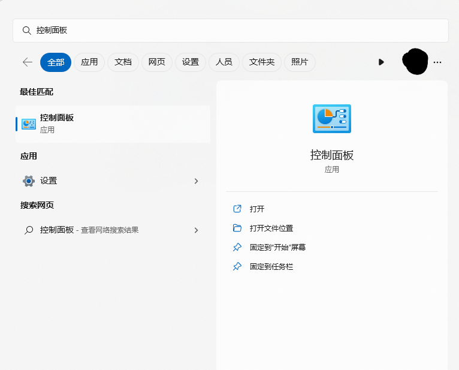
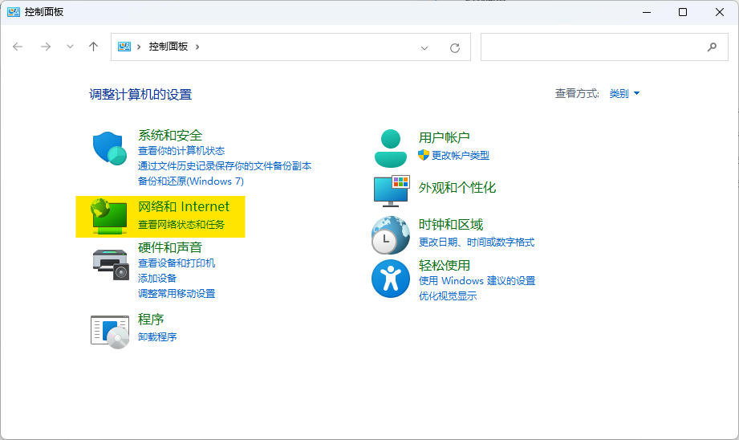
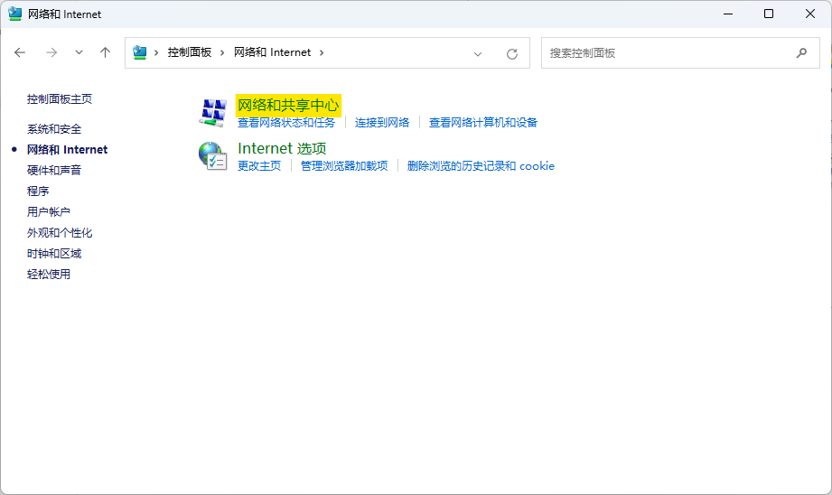
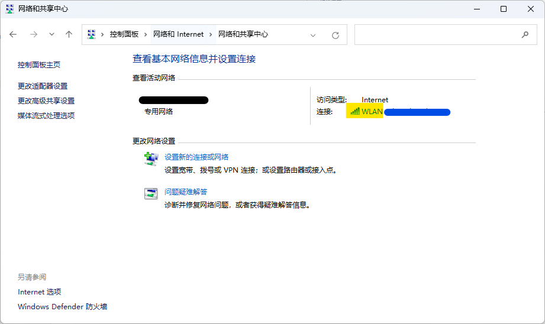
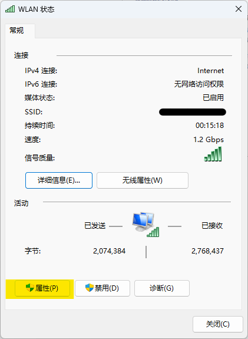
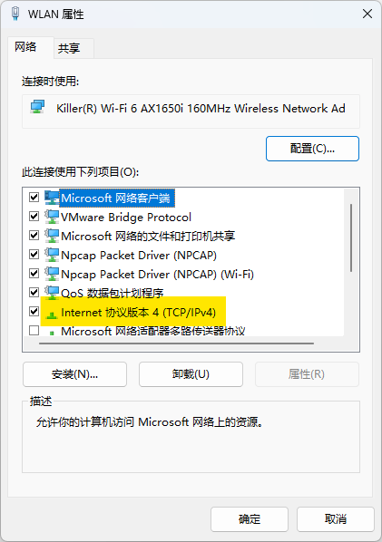
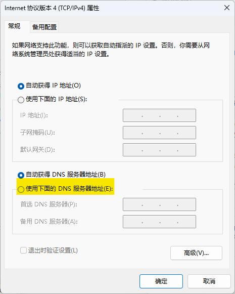
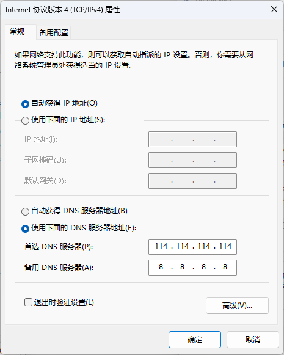

# 1.1 DNS 配置

>作者：杨嘉镒

>本作品采用<a rel="license" href="http://creativecommons.org/licenses/by-nc-sa/4.0/">知识共享署名-非商业性使用-相同方式共享 4.0 国际许可协议</a>进行许可。

DNS解析是用户在访问在线服务较为重要的一个环节，但是普通用户会很难察觉到其是影响到联网隐私性的一个重要因素。

大部分用户是通过域名访问在线服务的。但是本身来说，域名并不能访问在线服务，域名只是托管在线服务的服务器的一个“代号”。在域名没有被发明以前，人们需要使用一串类似于`192.168.31.1`的IP地址来连接在线服务的服务器。然而这一长串IP地址难以被记忆（尤其是使用IPV6以后），不便于用户的使用。此时的人们就在思考能否使用一些方便记忆的字符替代这些IP地址。

于是，域名被发明。域名的原理是通过申请，确保域名的拥有者能够将域名指向对应的服务器。比如，`baidu.com` 对应的IP地址是`110.242.68.66` 。这些域名和IP地址绑定的数据部分会存储在电脑本地，我们称其为**Host文件**。Host文件是能够被个人所控制的，但是无法存储太多的服务器数据。于是，人们又发明了**DNS服务器**。 DNS服务器存储了大部分的域名以及对应服务器地址数据。人们将会在连接到在线服务的服务器前，先行访问到DNS服务器，获取对应域名的服务器地址，然后再访问。

*DNS解析原理图*

然而，DNS服务器不止有一台。为了加速用户的访问速度，在各个地区，不同通讯公司，网络服务商部署着有不同的DNS解析服务器。然而这些服务器的管理方式各不相同，部分不安全的DNS服务器会解析出错误的IP地址，亦或者解析出的地址被篡改，我们称这种情况为**DNS污染**。这些不安全的DNS服务器可能会导致你被定向至不安全的网站甚至钓鱼网站。或者有部分DNS服务器会存储你的解析记录，以此能够知道你访问过哪些网站。为了保证我们上网的安全和隐私，建议根据以下步骤替换DNS服务器。

**步骤适用于windows电脑**
Step1：进入`控制面板`

Step2： 进入`网络和Internet`

Step3： 进入`网络和共享中心`

Step4：进入`Wlan`或`以太网`

Step5： 进入`属性`

Step6： 选择`Internet 协议版本4  (TCP/IPv4) `

step7：选择`使用下面的DNS服务器地址`

Step8：输入推荐的DNS服务器地址

>114DNS：首选：114.114.114.114  备选：114.114.114.115  
>阿里 AliDNS：首选：223.5.5.5  备选：223.6.6.6  
>Google DNS： 首选：8.8.8.8  备选：8.8.4.4  
>OpenDNS：首选：208.67.222.222  备选：208.67.220.220

我自己是这样填的：

恭喜你！在这里你已经成功更换掉了你的DNS服务器，相较于之前，你的网络连接更加安全、隐私。
如果你想要尝试更加安全、快速、隐私的DNS解析服务，可以自行探索**私人DNS**！