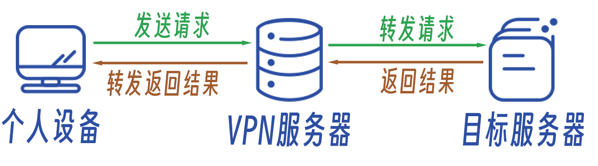
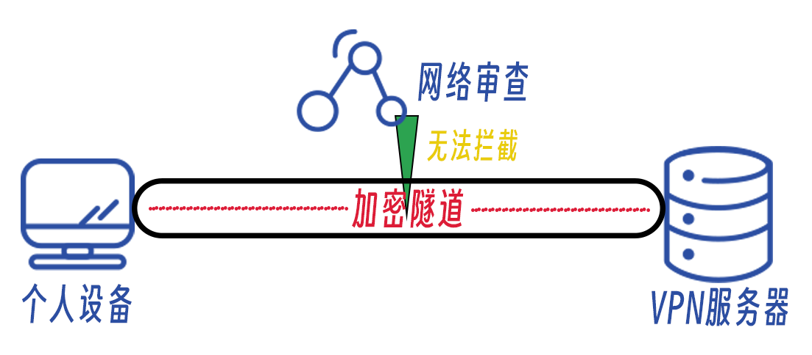

# 1.2 VPN介绍

> 作者：杨嘉镒

>本作品采用<a rel="license" href="http://creativecommons.org/licenses/by-nc-sa/4.0/">知识共享署名-非商业性使用-相同方式共享 4.0 国际许可协议</a>进行许可。

写在前面： VPN有多种用途，本文介绍的是能够保护个人连接安全和隐私的连接方法。

在访问在线服务时，你的电脑信息、IP地址会被访问的服务器所记录。并且在直接访问在线服务服务器时，你们之间的通讯内容可能会被监听、篡改，从而导致信息安全和隐私问题。

**VPN(虚拟专用网络)** 可以很好的解决这个问题。VPN服务能够在你与服务器之间建立一条专用网络隧道来达到安全访问的目的。这样的VPN服务适用于企业之间的信息加密传输、开发者远程进行运维、安全查看家中摄像头等情况。而对于我们个人用户，更加建议购买市面上的商业VPN服务。

商业VPN运营商会在全球各地建立VPN服务器以保证全球用户的连接速度。用户通过特定的软件能够建立个人设备与VPN服务器之间的加密隧道，确保个人设备与VPN服务器之间的通讯安全和隐私，而后VPN服务器会转发用户的网络请求。 

VPN原理图

这样一来，目标服务器就无法知道用户的真实IP地址与设备信息，只能记录VPN服务器的相关信息。个人设备与VPN服务器之间的连接又处于加密状态，难以被监听或篡改。

VPN对于个人用户而言还有一个巨大的作用：**避免网络审查** 在部分国际联网受限制的国家和地区，人们能够通过使用VPN服务避免网络审查制度。网络审查的原理是检测通讯的讯息中是否包含违禁内容，或者检测目标服务器IP是否存在于黑名单上。通常而言，如果VPN服务器设立在境外，那么由于个人设备与VPN服务器之间的连接因为加密无法被检测，便可以顺利绕过网络审查机制。一旦VPN服务器的IP地址被标记，或者使用了不安全的加密方法进行了连接，那么仍然可能会被网络审查阻止。

这里提供一些选购商业VPN时的建议：
1. 选择经营时间久、口碑好的运营商
2. 注意是否提供`无理由退款`服务，请尽量选择在一定时间内能够退款的运营商
3. 如果你处在受网络审查的国家和地区，请在购买前咨询运营商能否使用
4. 运营商最好处于欧洲（拥有完善的个人隐私法规）

一款优秀的商业VPN应当包含以下功能：
+ 强加密算法
+ 0服务器记录
+ 方便好用的跨平台软件
+ 优秀的客户支持
+ 数量庞大的服务器群
+ 快速的连接速度

当你使用优秀的商业VPN使用互联网后，您的在线活动安全和隐私会得到更加卓越的提升！
如果你需要极端的个人信息保护，你可以自行了解`Tor 浏览器`；如果你想要自己掌控数据，也可以自行了解`自建VPN服务`。