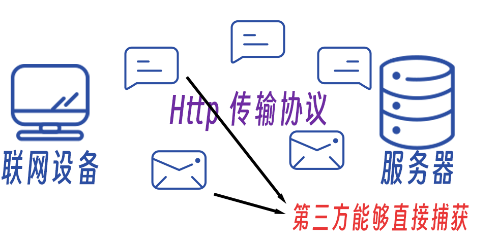
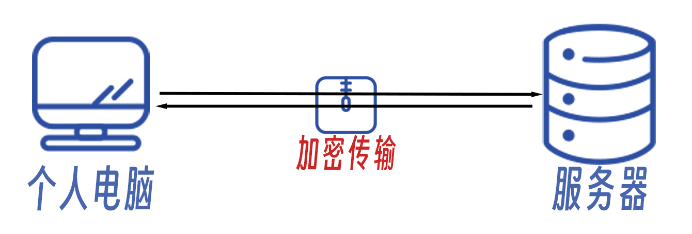
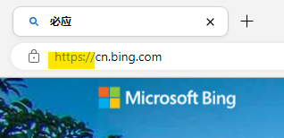
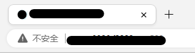

# 1.3 HTTP与HTTPS

> 作者：杨嘉镒

>本作品采用<a rel="license" href="http://creativecommons.org/licenses/by-nc-sa/4.0/">知识共享署名-非商业性使用-相同方式共享 4.0 国际许可协议</a>进行许可。

联网设备与服务器之间的通讯需要遵循一定的规则，否则就可能如美国人和日本人聊天一样——互相都不知道对方在说什么。于是**HTTP(超文本传输协议)** 孕育而生。HTTP是互联网上最为广泛使用的网络协议，提供了一种便携传输HTML文件的方法，能够增加浏览器的效率。然而HTTP协议有个致命缺点：**HTTP协议使用明文传输消息** 。一旦黑客截取了web浏览器与服务器之间传输的报文，便能直接获取传输内容。这将导致个人隐私的泄露以及在线连接的安全问题。如果在使用HTTP协议的网站上输入账号密码，那么极有可能导致账密被第三方截取。

HTTP原理图

>HTTP协议类似于你隔着马路和朋友大声交流，所有人都知道你们在聊什么。

为了解决HTTP的安全和隐私问题，**HTTPS**协议横空出世。HTTPS协议可以视为HTTP的安全版，它使用了SSL握手协议，在实际数据开始传输前，通讯双方首先协商加密方法、交换加密公钥等。加密算法对于个人用户而言稍显复杂，这里就不作过多介绍。

HTTPS协议使用了对称加密算法，确保了传输的信息只有通讯双方能够获取。

HTTPS原理图

>HTTPS协议就类似于你和女朋友之间通过双方约定的暗语进行交流，即使被别人听到了也不知道你们在说什么。

因此，为了确保在线连接的安全和私密，*请避免使用仅支持HTTP协议的网站*。如果不得不使用，请**切忌**在该网站上输入敏感信息(如密码，账号等)。

### 如何判断通讯协议？

浏览器的地址栏中会给出连接使用的通讯协议。

这个例子就是网站使用https进行连接的例子，在`://`前的字符代表着使用的通讯协议。

一旦浏览器在地址栏中提示`不安全`等字样，且域名前并没有`https://` 字样，意味着你当前正使用http协议进行连接。